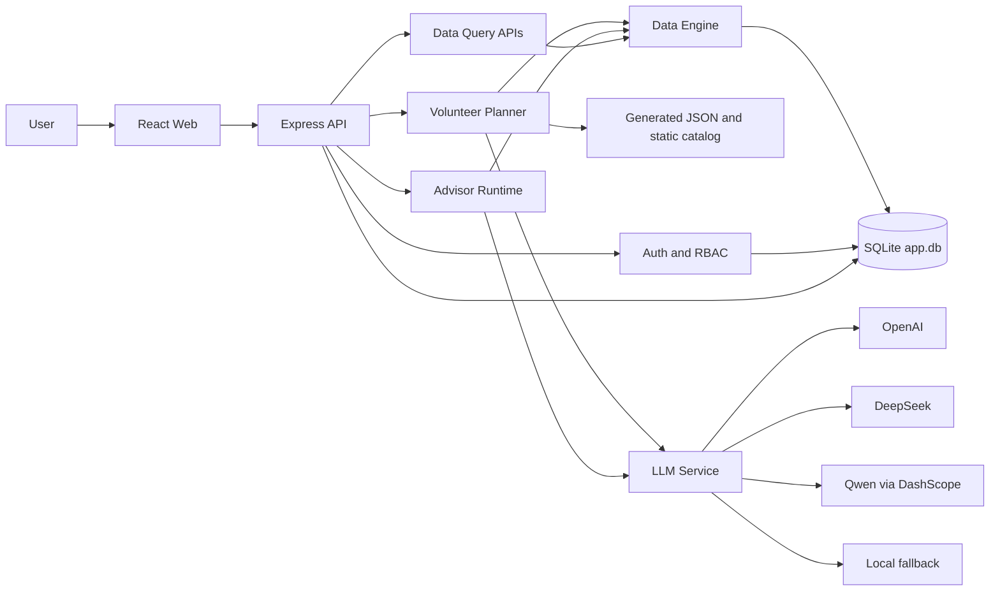
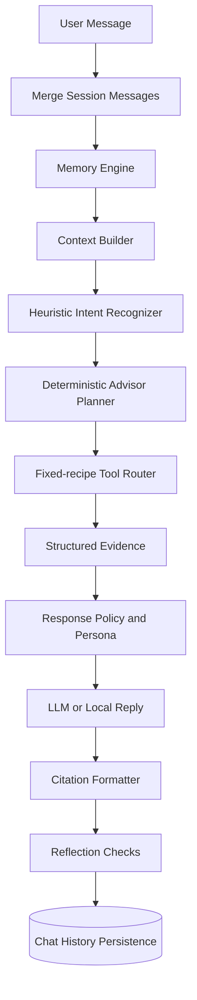

# GaokaoAPP / 志序 ZHIXU AI

> 面向高考志愿决策场景的 AI Decision System：以真实招生数据和确定性推荐为决策基础，以有状态 Advisor Workflow 和 LLM 完成解释与连续追问。

GaokaoAPP 不是让大模型直接决定志愿。系统先根据考生画像、位次、招生数据、选科与偏好生成规则化的“冲 / 稳 / 保”方案，再由 Advisor Runtime 检索证据、组织上下文并调用 LLM 解释结果。

```text
Candidate Profile
        ↓
Deterministic Recommendation
        ↓
Real Admission Data
        ↓
Risk / Preference Analysis
        ↓
Agent-like Advisor Workflow
        ↓
LLM Explanation
```

## 项目状态

| 范围                                              | 当前状态                     |
| ------------------------------------------------- | ---------------------------- |
| 决策工作台与完整用户流程                          | 已实现                       |
| 基于位次与历史录取数据的规则推荐                  | 已实现                       |
| Context / Memory / Intent / Planner / Tool Router | 已实现，采用确定性工作流     |
| 多模型 LLM 解释与本地降级                         | 已实现                       |
| Data Engine 分层与 CSV 导入                       | 已实现，Planner 尚未完全迁移 |
| Citation / Reflection                             | 后端已实现，前端尚未完整展示 |
| 全国 2021-2026 数据与生产级 Agent                 | Future                       |

当前准确定位是 **Agent-like Advisor Workflow / Deterministic Agent Runtime**，不是 Fully Autonomous Agent，也不是 Model-driven Tool-calling Agent。

## Demo / Screenshots

仓库已实现 Landing、考生画像、Decision Workspace、Advisor、院校详情、History、Account 与 Admin Users 页面。当前尚未发布可长期访问的公共 Demo，也未将本地 `preview/` 预览目录作为版本化求职截图交付物。

- 本地 Demo：按下文“本地运行”启动后访问 `http://127.0.0.1:4173`
- 90 秒演示脚本：[docs/portfolio/demo-script.md](docs/portfolio/demo-script.md)
- Future：补充稳定公共 Demo、版本化产品截图和可公开体验账号

## 1. 项目简介

志愿填报同时包含数据判断、约束过滤、风险分层和解释沟通。GaokaoAPP 将这些职责拆开：

- **Decision System**：承载画像录入、方案生成、院校查看、追问与历史恢复。
- **Deterministic Recommendation**：使用位次差、风险区间、偏好和选科约束形成候选池与冲稳保层级。
- **Data Engine**：以 SQLite、Repository、Query Service 和 Facade 管理招生领域数据。
- **Advisor Workflow**：从上下文与记忆中识别意图，按固定配方调用数据工具，构造证据后生成回复。
- **LLM Explanation**：负责结构化摘要和自然语言解释；无模型配置或调用失败时使用本地规则回复。

## 2. 为什么做这个项目

高考志愿是一个高风险、强约束、数据时效敏感的决策场景。让 LLM 凭参数记忆直接给学校和专业，容易产生三类问题：事实不可验证、规则边界被忽略、答案难以复现。

本项目选择“算法做决策、数据做证据、LLM 做解释”的边界，目标是演示一个可追踪、可降级、可评测的 LLM 应用工作流，而不是包装一个聊天界面。

## 3. 核心用户流程

1. 用户录入省份、科类、分数、位次、选科、风险偏好、城市与专业偏好。
2. `POST /api/planner/recommend` 校验画像并生成候选院校专业。
3. 推荐引擎执行数据召回、约束过滤、排序与冲稳保分层。
4. Decision Workspace 展示方案、风险信息、院校与专业细节。
5. 登录用户通过 `POST /api/chat/advisor` 围绕当前方案继续追问。
6. Advisor 合并会话、构造记忆、检索证据、调用模型并保存聊天历史。
7. History 支持恢复已保存的方案；Account 与 Admin Users 提供账号和权限入口。

## 4. 核心能力

- 端到端的高考决策闭环，而非单次 LLM 问答。
- 基于省份、科类、位次和历史线的冲稳保推荐。
- 城市、学费、院校标签、专业方向、选科与调剂意愿等约束处理。
- Advisor 连续追问、短指令承接和当前工作台上下文复用。
- 大学、专业、录取记录、招生计划和政策查询工具接口。
- SQLite 会话、方案、导入记录与认证状态持久化。
- 游客单次方案体验与登录用户 Advisor / History 能力分离。
- OpenAI、DeepSeek、通义千问兼容接入，以及本地 fallback。

## 5. 系统架构



详细说明：[系统总体架构](docs/architecture/system-architecture.md)。

## 6. Agent Architecture / Advisor Runtime



当前实现的重要边界：

- 意图识别主要依赖关键词与启发式规则。
- `AdvisorPlanner` 从固定 `TOOL_RECIPES` 选择工具，不是模型自主发出 `tool_calls`。
- Tool Router 是进程内同步路由，不是 JSON Schema 工具协议或 MCP。
- Reflection 检查证据、引用、画像和回答具体性，但不会自动重试或 replan。
- Memory 是每轮从当前方案、消息、最近历史和已存会话中提取的快照，不是向量长期记忆。
- Citation 与 Reflection 已返回在 API `meta` 中，当前 Advisor 页面尚未完整呈现这些信息。

完整设计与边界：[Agent Runtime](docs/architecture/agent-runtime.md) 与 [Advisor Runtime 技术说明](docs/technical/advisor-runtime.md)。

## 7. 推荐系统

推荐主链路位于 `apps/api/services/plannerService.js`：

```text
Profile normalization
→ interest / major-direction matching
→ imported-data recall + static fallback + rescue pool
→ hard-constraint filtering and preference scoring
→ rank-gap normalization
→ rush / steady / safe tiering
→ local summary
→ optional LLM structured summary
```

最终院校专业及层级由确定性逻辑生成。LLM 只尝试生成 `overview`、`strategy`、`careerAdvice` 和 `riskAlerts`；失败时保留本地摘要，不能改变推荐池。

当前 Planner 同时读取生成数据/静态目录和部分 Data Engine 能力，因此仍处于迁移阶段。详见 [推荐引擎](docs/technical/recommendation-engine.md) 与 [推荐流程](docs/architecture/recommendation-flow.md)。

## 8. 数据架构

Data Engine 位于 `apps/api/modules/data-engine/`，分为：

- SQLite Adapter：参数化查询与事务执行。
- Repository：大学、专业、位次、录取、招生计划、政策数据访问。
- Query Service：领域化查询。
- `RecommendationDataFacade`：向 Planner / Advisor 暴露稳定数据接口。
- `DataImportService`：CSV 标准化、范围校验、事务导入、数据源与导入任务记录。

主要实体包括 `university`、`major`、`score_rank_segment`、`admission_record`、`enrollment_plan`、`province_policy`、`volunteer_rule` 和 `career_outlook`。Schema 的覆盖面大于当前已导入数据。

详见 [数据架构](docs/architecture/data-architecture.md) 与 [Data Engine](docs/technical/data-engine.md)。

## 9. 技术栈

| 层     | 技术                                                                                 |
| ------ | ------------------------------------------------------------------------------------ |
| Web    | React 19、Vite 7、Framer Motion、GSAP、React Markdown                                |
| API    | Node.js、Express 5、Zod                                                              |
| AI     | OpenAI SDK；OpenAI Responses API；DeepSeek / Qwen OpenAI-compatible Chat Completions |
| Data   | Node `node:sqlite`、SQLite、CSV import pipeline                                      |
| Auth   | scrypt 密码哈希、签名 access/refresh token、会话轮换、RBAC                           |
| Test   | ESLint、Prettier、Node syntax check、Playwright、Advisor / Planner quality scripts   |
| Deploy | Multi-stage Docker、Docker Compose、Caddy、Render 配置                               |

## 10. 核心工程实现

1. **端到端决策闭环**：画像、推荐、解释、追问、历史恢复和账号管理形成完整产品路径。
2. **决策与生成解耦**：确定性推荐决定候选方案，LLM 不直接修改推荐结果。
3. **Advisor Runtime**：Context、Memory、Intent、Planner、Tool Router、Policy、Citation、Reflection 具有独立模块边界。
4. **可检索证据**：Advisor 工具通过 Data Engine 查询大学、专业、录取和计划数据。
5. **数据分层**：Repository / Query Service / Facade 隔离 SQLite 表结构与上层业务。
6. **多模型与降级**：按配置选择 OpenAI、DeepSeek、Qwen；未配置或失败时返回本地规则结果。
7. **认证与权限**：access/refresh token、会话轮换、token blacklist、RBAC 和后台用户管理。
8. **可部署交付**：Docker 多阶段构建、持久卷、健康检查、Caddy TLS 入口。

## 11. 测试与质量

可用命令：

```bash
npm run check
npm run lint
npm run format:check
npm run build
npm run test:smoke
npm run verify:advisor-quality
npm run verify:planner-quality
```

最近一次技术审计的实际结果（2026-08-21，基线 `465e071`）：

- `npm run check`：通过。
- `npm run lint`：0 error，1 warning；Landing 存在未使用的 `onGuestAction`。
- `npm run format:check`：未通过，报告 48 个文件格式不一致。
- `npm run verify:advisor-quality`：7 / 8 场景通过；广东物化生报临床医学的政策边界场景失败。
- `npm run verify:planner-quality`：在本地 API 启动后执行完成。

这些结果是基线快照，不代表持续集成状态；仓库目前没有 `.github/workflows` CI 配置。

## 12. 部署

生产构建由 Express 同时提供 API 与 `dist/` 静态文件。仓库包含：

- `Dockerfile`：Node 24 Alpine 多阶段构建。
- `deploy/docker-compose.yml`：App + Caddy、SQLite 持久卷和 `/api/health` 健康检查。
- `deploy/Caddyfile`：反向代理、压缩和基础响应头。
- `render.yaml`：Render Web Service 与持久磁盘配置。

部署文档见 [docs/deployment/DEPLOYMENT.md](docs/deployment/DEPLOYMENT.md)。生产环境至少需要设置强 `ADMIN_PASSWORD`，并为数据库配置持久化 `DATA_DIR`。

## 13. Demo

建议按以下顺序完成 90 秒求职演示：项目定位 → 录入画像 → 生成冲稳保 → 查看数据依据 → Advisor 追问 → 说明确定性工作流边界 → 恢复历史方案。

当前 Demo 不展示尚未在前端实现的 Agent Trace、Citation 面板或 Reflection 面板。完整脚本见 [docs/portfolio/demo-script.md](docs/portfolio/demo-script.md)。

## 14. Current Data Coverage

以下数字来自当前 `apps/api/storage/app.db` 的只读统计（2026-08-22）：

| 数据表             | 记录数 | 实际范围                                                |
| ------------------ | -----: | ------------------------------------------------------- |
| University         |  2,403 | 大学基础维度，不等于全国均有完整招生数据                |
| Major              |    102 | 专业基础维度                                            |
| Score Rank Segment |  1,171 | 广东 2025：历史 573、物理 598                           |
| Admission Record   |  5,137 | 广东 2025：历史 1,634、物理 3,503                       |
| Enrollment Plan    |  5,166 | 5,137 条由历史线推断；29 条为 2026 华南理工大学官方样本 |
| Province Policy    |      0 | Schema 已建，尚未导入                                   |
| Volunteer Rule     |      0 | Schema 已建，尚未导入                                   |
| Career Outlook     |      0 | Schema 已建，尚未导入                                   |

可诚实支持的口径是：**以广东 2025 历史参考数据为主，并包含广东 2026 物理类华南理工大学 29 条官方招生计划样本的数据驱动原型。**

数据来源文件与导入说明见 [data/import/README.md](data/import/README.md)。正式填报前必须回到考试院和高校官方信息核验。

## 15. Known Limitations

- 当前不是 Fully Autonomous Agent。
- Tool Router 不是 Model-driven Tool Calling，也没有迭代 Agent Loop、状态机、checkpoint 或 recovery。
- 数据不具备全国 2021-2026 完整覆盖，不能支撑全国多省真实推荐。
- 2026 招生计划仅有华南理工大学广东物理类样本。
- `province_policy`、`volunteer_rule`、`career_outlook` 当前为空，政策、规则、就业和薪资结论不能视为完整数据核验结果。
- 录取概率是启发式 confidence，不是真实录取概率，也未做统计校准。
- Planner 与 Data Engine 尚未完全统一，仍包含生成数据和静态 fallback。
- Citation、Tool Invocation、Evidence Strength 与 Reflection 尚未完整展示到前端。
- Reflection 只检查并返回问题，不会自动修复回答。
- 生产级结构化日志、trace ID、指标、OpenTelemetry、限流、备份恢复和数据库迁移尚未完成。
- CORS 当前允许反射请求 origin；前端也会将 bearer token 写入 `localStorage`，生产安全策略仍需收紧。

## 16. Roadmap

### Phase 1 - Documentation and portfolio baseline

- README、架构文档、技术文档、Demo、博客与面试材料。

### Phase 2 - Data foundation

- 补齐来源 lineage、校验和、错误行治理与广东多年份数据。
- 导入政策、志愿规则和可核验职业数据。

### Phase 3 - Real Agent Runtime

- Typed tools + JSON Schema。
- Model-driven Tool Calling、受控 Agent Loop、max-step guard。
- State Machine、timeout / retry / replan / recovery 与 Agent Event Trace。

### Phase 4 - Grounded recommendation

- Planner 全面迁移到 Data Engine。
- 选科与政策规则工具、证据包、概率校准和离线评测集。

### Phase 5 - AI Decision OS and production

- 前端展示工具调用、数据年份、引用、证据强度、风险变化与记忆变化。
- CI/CD、迁移、备份、结构化可观测性、成本与延迟追踪。

Future 项目均为设计目标，不属于当前已实现能力。

## 17. 项目难点

- 在强时效、高风险领域划清“数据事实、确定性规则、模型解释”的责任边界。
- 将分数、位次、院校专业历史线与用户软偏好合并为可解释的分层方案。
- 在连续追问中压缩当前方案、会话和稳定画像，同时避免短追问丢失语义。
- 让数据模型既能记录来源和导入任务，又能被 Planner 与 Advisor 复用。
- 在外部模型不可用时保持推荐与基础解释可用，而不是让整个流程失败。

## 18. 求职技术亮点

面向 AI Agent Engineer / AI Application Engineer / LLM Application Engineer 岗位，本项目最值得讨论的不是 UI 包装，而是：

- 真实业务约束下的 LLM 责任边界设计。
- Deterministic Agent Runtime 的模块拆分与未来迁移路径。
- 规则推荐、数据检索、证据组织和 LLM 解释的组合。
- 多模型适配、本地 fallback 与结构化摘要。
- Citation / Reflection 元数据与离线质量脚本的初步闭环。
- 数据导入、认证授权、持久化、部署和 E2E 组成的完整应用工程。

面试准备见 [docs/portfolio/interview-notes.md](docs/portfolio/interview-notes.md)，技术博客规划见 [docs/portfolio/technical-blog-roadmap.md](docs/portfolio/technical-blog-roadmap.md)。

## 19. 本地运行

### 环境要求

- Node.js 24（项目使用内置 `node:sqlite`）
- npm

### 安装与启动

```bash
npm install
Copy-Item .env.example .env
npm run dev
```

默认地址：

- Web：`http://127.0.0.1:4173`
- API health：`http://127.0.0.1:3001/api/health`

单独启动：

```bash
npm run dev:client
npm run dev:server
```

模型密钥均为可选；未配置时，Planner 和 Advisor 使用本地规则 fallback。生产运行前必须修改管理员密码，并根据需要配置：

```env
PORT=3001
DATA_DIR=
ADMIN_USERNAME=
ADMIN_PASSWORD=

OPENAI_API_KEY=
OPENAI_MODEL=
DEEPSEEK_API_KEY=
DEEPSEEK_MODEL=
DASHSCOPE_API_KEY=
DASHSCOPE_MODEL=
DASHSCOPE_BASE_URL=
```

生产构建：

```bash
npm run build
npm start
```

## 文档索引

- Architecture：[system](docs/architecture/system-architecture.md) · [agent runtime](docs/architecture/agent-runtime.md) · [data](docs/architecture/data-architecture.md) · [advisor flow](docs/architecture/advisor-flow.md) · [recommendation flow](docs/architecture/recommendation-flow.md)
- Technical：[advisor runtime](docs/technical/advisor-runtime.md) · [recommendation engine](docs/technical/recommendation-engine.md) · [data engine](docs/technical/data-engine.md) · [engineering](docs/technical/engineering.md)
- Portfolio：[demo script](docs/portfolio/demo-script.md) · [technical blog roadmap](docs/portfolio/technical-blog-roadmap.md) · [interview notes](docs/portfolio/interview-notes.md)
