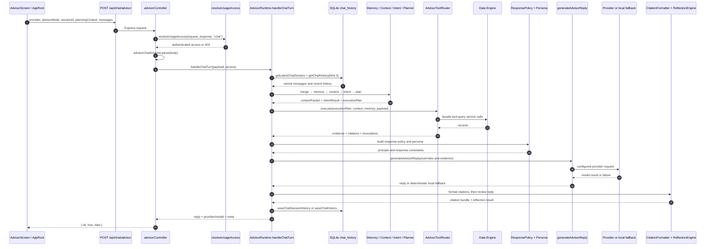

# Advisor 调用链

## HTTP 到持久化

以下调用链与当前代码顺序一致。

## 请求与访问控制

`advisorChatSchema` 接收：

- `provider`：默认 `auto`；
- `advisorMode`：`xuefeng` 或 `gentle`；
- `sessionId`：可选；
- `planningContext`：当前推荐结果；
- `messages`：至少一条 user / assistant / system 消息。

Advisor 仅向已登录用户开放。`resolveUsageAccess(..., "chat")` 会拒绝游客连续对话；游客只允许一次 Planner 体验。

## 数据流细节

1. `mergeChatMessages` 合并数据库中的会话与前端提交消息。
2. `MemoryEngine.build` 提取稳定画像、偏好、Workspace 和对话信号。
3. `ContextBuilder.build` 组织当前消息、上一条助手回复、最近 12 条消息和最多 3 条历史记录。
4. `IntentRecognizer.recognize` 使用启发式规则选出 primary intent。
5. `AdvisorPlanner.plan` 从固定工具配方得到执行计划。
6. `AdvisorToolRouter.execute` 同步查询 Workspace 或 Data Engine，生成 evidence、citations 和 invocation metadata。
7. `AdvisorResponsePolicy` 与 `PersonaEngine` 构造系统提示和回答形态。
8. `generateAdvisorReply` 调用模型；未配置或失败时使用本地回复。
9. Citation Formatter 去重和规范化引用；Reflection 检查 grounding 与具体性。
10. 最多 20 条消息写入 `chat_history`。

## 前端当前消费范围

后端返回完整 `meta`，但 `AppRoot.handleSendChat` 当前只把 `reply`、`provider` 和 `model` 写入前端消息。因此工具调用、引用和 Reflection 是后端可观测元数据，不是现有 UI 功能。

## 非当前能力

- 模型自主选择工具。
- 多步循环和动态终止判断。
- Reflection 失败后的自动重试。
- durable task checkpoint 与跨进程恢复。
- MCP、RAG 或 Multi-Agent orchestration。
