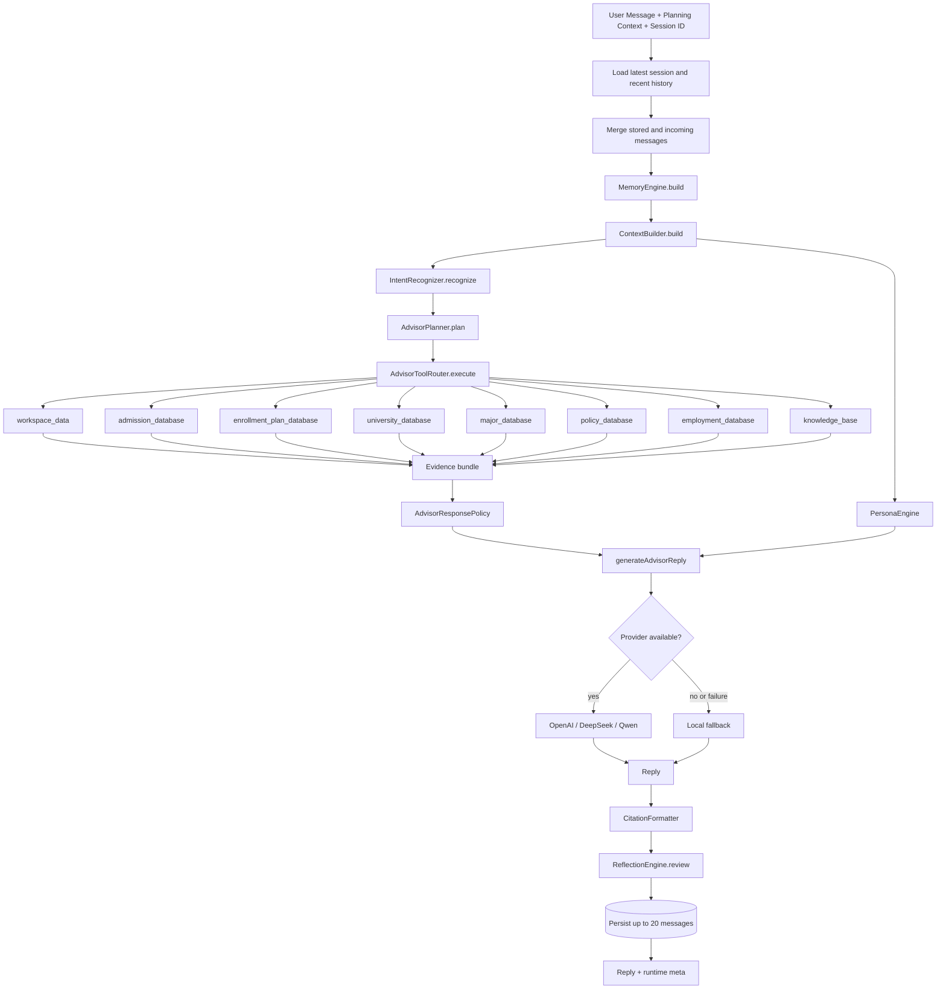
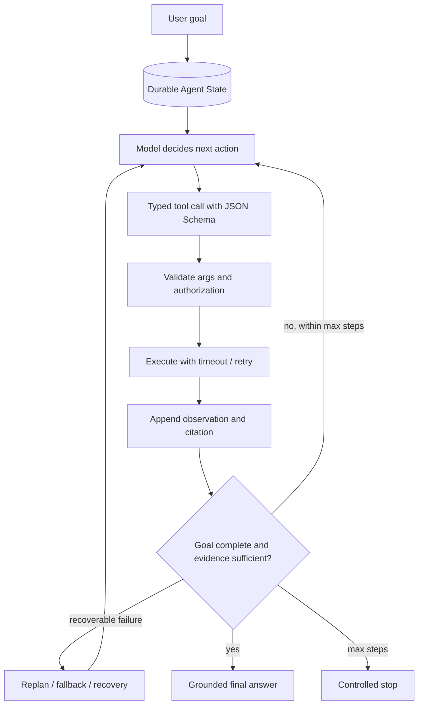

# Agent Runtime 架构

## 定位

当前 Advisor 是 **Deterministic Agent Runtime / Agent-like Workflow**。它具备上下文、记忆、规划、工具路由、证据、模型生成、引用、反思和持久化，但决策路径由代码规则控制，不是模型自主循环。

## 当前运行时



## 确定性决策点

1. `IntentRecognizer` 通过关键词计分和启发式正则识别意图。
2. `AdvisorPlanner` 按 `TOOL_RECIPES[primaryIntent]` 选择固定工具组合，并根据问题补充少量工具。
3. `AdvisorToolRouter` 使用 `switch` 调用进程内函数，工具没有独立 JSON Schema，也不由模型发起。
4. `AdvisorResponsePolicy` 根据意图、证据和对比对象构造回复边界。
5. LLM 接收已经组织好的上下文与证据，负责表达，而不是决定执行图。

## 状态与记忆

- **输入状态**：`planningContext` 包含当前推荐方案和考生画像。
- **会话状态**：按 `sessionId` 读取最近保存的消息，并与本轮消息合并。
- **Memory Snapshot**：从画像、偏好、Workspace 和对话信号重新提取；不是独立长期记忆数据库。
- **历史上下文**：读取最多 3 条最近聊天记录用于摘要。
- **持久化**：回复后最多保存 20 条合并消息到 `chat_history`。

## 结构化输出

API 除 `reply`、`provider`、`model` 外，还返回 `meta`：

- runtime / context / memory / intent / planner / router / policy / citation / reflection 版本；
- primary intent、planned tools、resolved entities；
- tool invocations、citations、citation summary；
- evidence strength、response focus、reflection checks and issues。

这些元数据为未来 Trace UI 和离线评测提供基础，但当前前端聊天消息只保留回复文本、provider 和 model，尚未完整展示 `meta`。

## Reflection 的实际作用

Reflection 检查外部证据、画像完整性、回答 grounding、引用覆盖、Workspace 锚点、对比覆盖、实体具体性和泛化表达。当前它只返回 `pass / warn`、issues 和 `reviewRequired`：

```text
reply → review → attach meta → persist
```

不存在以下闭环：

```text
review failed → retry tool → replan → regenerate
```

## Future：Model-driven Agent Runtime



Future 能力包括 model-driven Tool Calling、Agent Loop、durable state machine、checkpoint、max-step guard、timeout/retry、replan/recovery 和可视化 Agent Event Trace。它们是路线图，不是当前功能。
