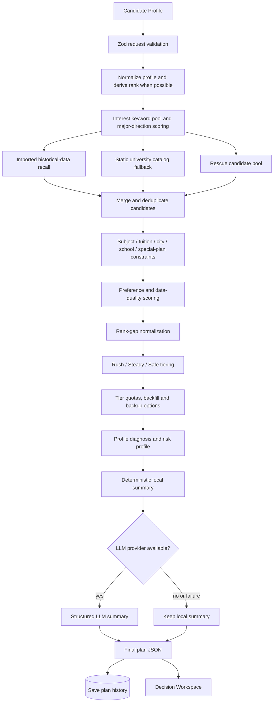

# 志愿推荐流程

## 当前主流程



## 输入

Planner 接收：省份、考试模式、历史/物理、选科、分数、位次、风险偏好、城市、职业计划、学费、英语成绩、考生类型、特殊计划、健康说明、服从调剂、兴趣、性格、院校标签、专业需求和科目限制。

Zod 负责 HTTP 参数合法性；`normalizeProfile` 会在可能时根据一分一段数据推导缺失位次，并补齐可选字段默认值。

## 召回与过滤

当前存在三类候选来源：

- **Data-driven pool**：来自导入后的历史院校专业数据。
- **Static fallback pool**：来自仓库内大学与专业目录，保证数据不足时仍可演示。
- **Rescue pool**：为低分段或候选不足场景补足可报选项。

随后执行选科要求、特殊项目、学费、城市、院校标签与专业方向等硬/软约束。软偏好可能在候选不足时被放宽，并在推荐理由中提示。

## 排序与冲稳保

核心参考是当前位次与历史最低位次的差值/比例。风险配置影响区间，Planner V3 再用动态 rank margin 形成：

- **冲**：历史门槛优于当前位次，在允许的负位次差窗口内。
- **稳**：当前位次接近历史门槛。
- **保**：当前位次优于历史门槛，并位于安全窗口内。

候选还会叠加方向匹配、城市、院校标签、历史记录数量等评分。confidence 是规则函数输出，用于排序和解释，不是基于真实录取标签校准的概率。

## LLM 的责任边界

`generateStructuredPlanningSummary` 只请求以下结构：

```json
{
  "overview": "string",
  "strategy": "string",
  "careerAdvice": "string",
  "riskAlerts": ["string"]
}
```

LLM 输入包含已经生成的画像诊断、专业方向和 Top recommendations。模型不参与候选召回、约束过滤、排名或冲稳保分层；调用失败时使用本地摘要。

## 已知限制

- Planner 数据访问尚未完全迁移到 Data Engine Facade。
- 静态与 rescue fallback 提高了可用性，也意味着部分条目不等同于完整官方当年计划。
- 2025 历史数据不能替代 2026 正式招生计划。
- confidence 未经真实录取结果校准，不能表述为录取概率。
- 政策与志愿规则表为空，选科/批次边界仍有质量测试失败案例。

## Future

- Planner 全量使用 Data Engine 和带 lineage 的 evidence bundle。
- 将 policy / subject rule 作为正式硬约束工具。
- 基于多年份数据建模趋势、波动和冷启动规则。
- 使用真实录取结果做概率校准、分桶评估与回测。
- 为每条推荐展示来源、年份、规则命中与风险变化。
