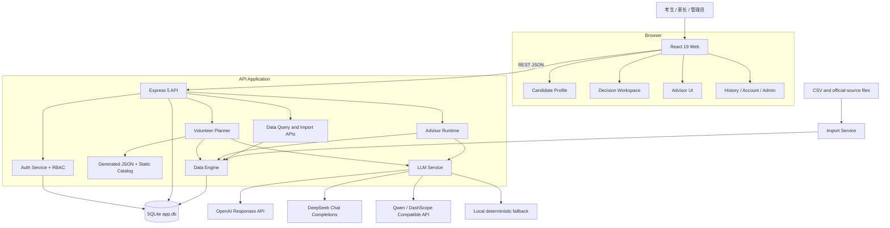
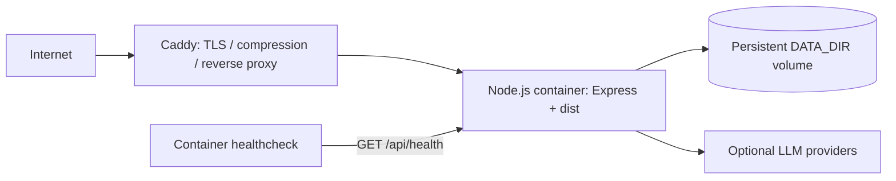

# 系统总体架构

本文描述当前仓库真实运行结构。GaokaoAPP 是一个单仓库 Web 应用：React 前端调用 Express API，业务与身份数据存储在同一个 SQLite 数据库中，外部 LLM 是可选依赖。

## 组件关系

## 运行边界

| 层              | 主要职责                                          | 关键实现                                          |
| --------------- | ------------------------------------------------- | ------------------------------------------------- |
| Web             | 路由状态、画像录入、方案与 Advisor 展示           | `apps/web/src/AppRoot.jsx`、`apps/web/src/pages/` |
| API composition | 路由、Zod 校验、依赖装配、错误响应                | `apps/api/app.js`                                 |
| Planner         | 候选池、约束、排序、冲稳保与摘要                  | `apps/api/services/plannerService.js`             |
| Advisor         | 有状态追问、证据工具、回复策略与复盘              | `apps/api/modules/advisor/`                       |
| Data Engine     | Schema、Repository、Query Service、Facade、Import | `apps/api/modules/data-engine/`                   |
| Persistence     | 用户、会话、方案、聊天、导入及领域数据            | `apps/api/storage/app.db`                         |
| LLM             | 多供应商调用与本地 fallback                       | `apps/api/services/llmService.js`                 |

## 请求路径

- 推荐：`Web → POST /api/planner/recommend → generateVolunteerPlan → SQLite / generated data → optional LLM summary`。
- Advisor：`Web → POST /api/chat/advisor → AdvisorRuntime.handleChatTurn → tools / LLM → chat_history`。
- 数据查询：`Web or API client → /api/data/* → Data Engine Query Services → SQLite`。
- 管理：`Web → /api/admin/* → Auth + RBAC → users / imports / history`。

## 部署拓扑

Docker Compose 为推荐部署路径之一；Render 另有 `render.yaml`。当前没有独立缓存、队列、对象存储或 observability backend。

## 当前限制

- Express 路由和应用装配仍集中在 `apps/api/app.js`。
- Planner 与 Data Engine 处于并行/迁移状态，而不是单一数据访问路径。
- SQLite 适合当前单实例作品集与低并发部署，不代表已完成横向扩展设计。
- 外部 LLM 不可用时会降级，但尚无统一 timeout、retry、circuit breaker 和成本追踪层。
